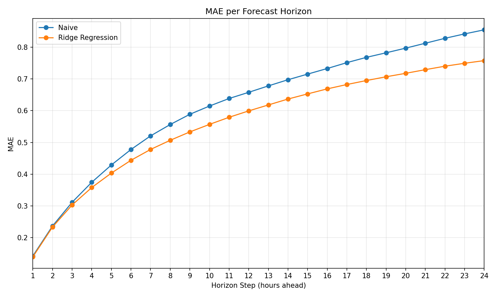
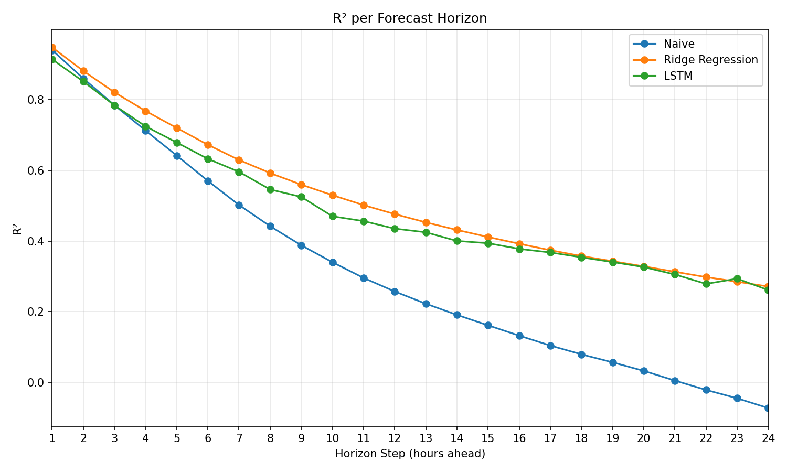

# Air Quality Forecasting with Machine Learning and LSTM

## Project Overview 

This project builds and evaluates machine learning models for **multi-step time series forecasting of air pollution levels**.

Using historical air quality and meteorological data, the goal is to predict **PM2.5 concentration for the next 24 hours** based on the previous 48 hours of observations.

The project compares:

- naive time-series baselines
- regularized linear regression (Ridge)
- a deep learning model based on **LSTM**

All models are evaluated using **multi-horizon forecasting metrics** and compared across forecast horizons.

The repository demonstrates a full **Applied ML workflow for time-series forecasting**, including:

- data preprocessing
- feature scaling
- sliding window dataset construction
- baseline modelling
- neural network training
- horizon-wise evaluation
- visualization of forecast performance

## Dataset

The project uses an air quality dataset containing hourly observations of pollution and meteorological variables.

The dataset includes measurements such as:

- PM2.5 concentration (target variable)
- temperature
- pressure
- dew point
- wind speed
- precipitation
- other atmospheric indicators

Each row corresponds to **one hour of observations**.

The dataset is included in the repository under:

[`data/raw/PRSA_Data_Wanshouxigong_20130301-20170228.csv`](data/raw/PRSA_Data_Wanshouxigong_20130301-20170228.csv)

### Target

The forecasting target is:

```
PM2.5 concentration
```

### Forecasting task

The models predict **24 future hourly values** of PM2.5 based on the **previous 48 hours of data**.

```
Input window: 48 hours
Forecast horizon: 24 hours
```

## Problem Formulation

The forecasting task is formulated as a **multi-step time series regression problem**.

For each training example:
```
X = past 48 hours of observations
y = next 24 hours of PM2.5 values
```

The dataset is converted into supervised learning samples using a **sliding window approach**.


Evaluation is performed using a **chronological train / validation / test split** to avoid data leakage.

Metrics are computed for:

- the entire forecast horizon
- each individual forecast step

## Project Structure
```
air-quality-forecasting
│
├── configs
│   ├── base.yaml                 # default configuration
│   └── experiments               # configs for LSTM experiments
│       ├── lstm_baseline.yaml
│       ├── lstm_dropout.yaml
│       └── lstm_small_lr.yaml
│
├── data
│   └── raw
│       └── air_quality.csv       # dataset
│
├── notebooks
│   └── analysis.ipynb            # exploratory analysis
│
├── reports
│   ├── experiments               # experiment metrics
│   ├── figures                   # generated plots
│   ├── baselines_metrics.json
│   └── ridge_metrics.json
│
├── src
│   └── air_quality_forecasting
│       ├── baselines.py          # naive forecasting baselines
│       ├── config.py             # config loading utilities
│       ├── datasets.py           # dataset creation and splits
│       ├── evaluate.py           # forecasting metrics
│       ├── generate_plots.py     # generate evaluation plots
│       ├── models.py             # model definitions (Ridge, LSTM)
│       ├── preprocessing.py      # data preprocessing utilities
│       ├── run_baselines.py      # run baseline models
│       ├── run_linear_model.py   # train Ridge regression model
│       ├── run_rnn.py            # train LSTM model
│       ├── utils.py              # helper functions
│       └── visualization.py      # plotting utilities
│
├── .gitignore
├── LICENSE
├── README.md
└── requirements.txt
```

### Key components

**datasets.py**

Creates train/validation/test splits and constructs sliding window datasets.

**run_baselines.py**

Runs naive forecasting baselines.

**run_linear_model.py**

Trains a Ridge regression model using lagged input windows.

**run_rnn.py**

Trains an LSTM model for multi-step forecasting.

**evaluate.py**

Computes evaluation metrics including MAE, RMSE and R² across forecast horizons.

**visualization.py**

Generates plots for forecast examples and horizon-wise model comparison.

## Methodology

### Data preprocessing

The dataset consists of hourly air quality and meteorological observations.  
Data preprocessing includes:

- chronological sorting of observations
- handling missing values via imputation
- feature scaling using `StandardScaler`
- separate scaling of features and target variable

Scaling is performed **after the train/validation/test split** to avoid data leakage.

---

### Sliding window dataset

The time series is transformed into a supervised learning dataset using a **sliding window approach**.

Each training example consists of:

```
Input: previous 48 hours of observations
Target: next 24 hours of PM2.5 values
```

This produces input tensors with shape:

```
(samples, window_size, n_features)
```

and targets:

```
(samples, forecast_horizon)
```


---

### Models

The project compares several forecasting approaches:

**Naive baseline**

Uses the most recent observation as the prediction for all future time steps.

**Seasonal naive baseline**

Uses the observation from the same hour in the previous daily cycle as the forecast.
This baseline captures simple daily seasonality in the time series.

**Ridge regression**

A regularized linear regression model trained on flattened input windows.

This model serves as a strong classical baseline for time-series forecasting.

**LSTM**

A recurrent neural network model trained on sequential input windows.

Architecture:

```
Input → LSTM → Dense → 24-step forecast
```

Training uses:

- Mean Squared Error loss
- Adam optimizer
- Early stopping based on validation loss

---

### Evaluation

Models are evaluated using a **chronological train / validation / test split**.

Metrics are computed on the **original scale of the target variable** using inverse scaling.

Evaluation metrics include:

- Mean Absolute Error (MAE)
- Root Mean Squared Error (RMSE)
- R² score

Performance is reported:

- for the entire forecast horizon
- for each individual forecast step

This allows comparison of models across short- and long-term forecasts.

## Results

The final comparison focuses on three representative models:

- **Naive baseline**
- **Ridge regression**
- **LSTM**

Ridge achieved the best overall performance on the test set, while the LSTM remained competitive but did not outperform the linear baseline.

### Test set performance

| Model | MAE | RMSE | R² |
|---|---:|---:|---:|
| Naive | 50.67 | 85.37 | 0.32 |
| Ridge | **46.16** | **71.88** | **0.515** |
| LSTM | 46.79 | 73.77 | 0.489 |

### Horizon-wise performance

#### MAE per forecast horizon



#### R² per forecast horizon



### Discussion

Several observations stand out from the results:

- **Ridge regression performed best overall**, especially for short-term forecasts.
- **LSTM remained competitive**, but did not surpass the linear baseline on the test set.
- The gap between Ridge and LSTM was relatively small, suggesting that the dataset's temporal structure can already be captured well by a regularized linear model.
- Forecasting error increases with the horizon for all models, which is expected in multi-step forecasting tasks.

Overall, the results show that **strong classical baselines are essential in time-series forecasting**, and that a more complex neural architecture does not automatically outperform simpler models.