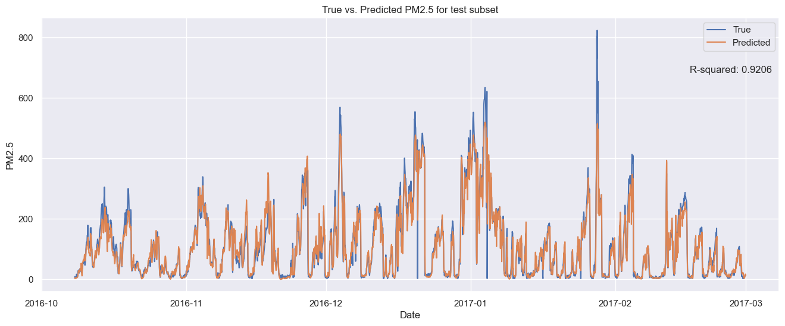

# Air Quality in Beijing 

## Overview 

This project aims to build a recurrent neural network (RNN) for predicting PM2.5 air pollution levels in Beijing using time-series analysis. The work was completed as part of post-graduate studies at the Polish-Japanese Academy of Information Technology (PJAIT).

## Dataset 

The project is based on measurements from the Wanshouxigong meteorological station in Beijing, collected hourly from 2013-03-01 to 2017-02-28.
During exploratory analysis, missing values for each variable were inspected. The gaps were filled via interpolation, and missing values in the PM2.5 target variable were removed. Descriptive statistics, histograms, box plots, and distribution analyses were performed, with particular attention to outliers.
A correlation matrix was generated to examine relationships between variables and the target. Three variables (PRES, DEWP, RAIN) showed negligible correlation and were removed from the dataset.
After preprocessing, the dataset was split into features and target, standardized using two separate StandardScaler instances, and then divided into training and test sets (90:10) without shuffling. Using the TimeSeriesGenerator, batches were created with a window size of 24 and initial batch size of 64.

## Model 

A sequential RNN model built with stacked LSTM layers:

model = Sequential([
    LSTM(128, return_sequences=True, input_shape=(n_window, n_features)),
    Dropout(0.2),
    LSTM(32, return_sequences=True),
    Dropout(0.2),
    LSTM(8),
    Dropout(0.2),
    Dense(1, activation='linear')
])

The model was compiled using the Adam and RMSProp optimizers - the choice between either of them showed no substantial difference. MSE and the R² score were chosen as loss function and performance metric respectively. The model was trained using EarlyStopping and dropout was added after each LSTM layer to prevent overfitting. 

## Results 

The model achieves an R² value of 0.92 for the test set. This indicates that the model has good predictive ability and accounts for seasonal and short-term patterns. It is confirmed by the graph, where the predicted values ​​mostly match or are close to the actual values. The exception are outlier observations, which the model, striving to find more generalized patterns of feature behavior, struggles with.Increasing model depth with more LSTM layers did not result in improved performance.
In summary, the created recurrent neural network model can be used to make fairly accurate predictions of future air pollution levels.

## Tech Stack 

- Python 3.10 
- NumPy, Pandas, Scikit-learn
- TensorFlow / Keras
- Matplotlib, Seaborn

## Setup 

###. Clone the repository 
git clone https://github.com/przemekwarnel/air-quality-rnn.git
### 2. Install dependencies 
pip install -r requirements.txt
### 3. Run the notebook 
jupyter notebook air_quality_rnn.ipynb

## Author

Przemysław Warnel 
przemekwarnel@gmail.com
